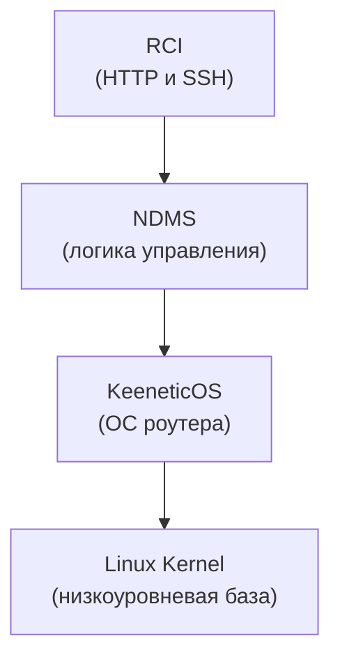

# Keenetic RCI

Kotlin SDK для взаимодействия с Keenetic NDMS RCI через HTTP или SSH.

## Содержание

- [Обзор](#обзор)
- [Статус проекта](#статус-проекта)
- [Использование](#использование)
  - [HTTP](#http)
  - [SSH](#ssh)
  - [Сохранение конфигурации](#сохранение-конфигурации)
- [Доступные API](#доступные-api)
  - [System API](#system-api)
  - [Interface API](#interface-api)
  - [Routing API](#routing-api)

## Обзор

`keenetic-rci` — Kotlin-библиотека для программного взаимодействия с роутерами Keenetic через NDMS RCI.

Keenetic управляется через NDMS (Network Device Management System). RCI — это слой доступа к внутренней модели NDMS, 
через который работают CLI, Web UI, HTTP API, мобильное приложение и облако.

`keenetic-rci` дает один Kotlin API поверх двух способов обращения к этой модели:

- `HTTP/RCI`: JSON-запросы в `/rci/`;
- `CLI/RCI (over SSH)`: текстовые NDMS-команды вроде `show version` и `show interface`.



## Статус проекта

Проект находится в активной разработке. Сейчас библиотека реализует только часть возможностей Keenetic NDMS RCI.
Остальные функции будут добавляться постепенно.

Актуальный список поддерживаемых API описан в разделе [Доступные API](#доступные-api).

## Использование

### HTTP

> [!IMPORTANT]
> Пользователь Keenetic, указанный в `credentials(...)`, должен иметь как минимум доступ **«Веб-конфигуратор»**.

```kotlin
import com.github.khetaghub.keenetic.rci.api.KeeneticApi
import com.github.khetaghub.keenetic.rci.transport.HttpTransport

val transport: KeeneticTransport = HttpTransport.builder()
    .baseUrl("192.168.1.1") // также можно указать доменное имя KeenDNS
    .credentials("admin", "password")
    .build()

val api = KeeneticApi.create(transport)

val version = api.system().version()
```

`HttpTransport` авторизуется лениво при первом запросе и один раз повторяет авторизацию, если получает ответ `401`.

### SSH

> [!IMPORTANT]
> Пользователь Keenetic, указанный в `credentials(...)`, должен иметь как минимум доступ **«Командная строка»**.

```kotlin
import com.github.khetaghub.keenetic.rci.api.KeeneticApi
import com.github.khetaghub.keenetic.rci.transport.SshTransport

val transport: KeeneticTransport = SshTransport.builder()
    .host("192.168.1.1")
    .credentials("admin", "password")
    .allowAnyHostKey()
    .build()

val api = KeeneticApi.create(transport)

val version = api.system().version()
```

Для production-использования лучше передавать `knownHostsFile(...)` или собственный `hostKeyVerifier(...)` вместо `allowAnyHostKey()`.

### Сохранение конфигурации

NDMS разделяет **running-конфигурацию** и **startup-конфигурацию**. Если изменения должны пережить перезагрузку, нужно вызвать:

```kotlin
api.system().configurationSave()
```

## Доступные API

Текущая публичная точка входа — `KeeneticApi.create(transport)`. Она открывает фасады `system()`, `interfaces()`, `routing()` и метод `executeRaw(rawCommand)`.

`executeRaw(rawCommand)` нужен для случаев, когда в SDK еще нет типизированного метода. Для `HttpTransport` он принимает готовое JSON-тело запроса `/rci/`, а для `SshTransport` — CLI-команду NDMS, например `show version`.

Пример для `SshTransport`:

```kotlin
val response = api.executeRaw("show version")
```

Пример для `HttpTransport`:

```kotlin
val response = api.executeRaw("""{"show":{"version":{}}}""")
```

### Interface API

`interfaces()` — фасад для управления интерфейсами.

| Метод | Что делает | HTTP RCI | CLI |
| --- | --- | --- | --- |
| `api.interfaces().getInterfacesList()` | Возвращает список интерфейсов (`List<Interface>`) | `show.interface` | `show interface` |

### System API

`system()` — фасад для работы с системой и конфигурациями.

| Метод | Что делает | HTTP RCI | CLI |
| --- | --- | --- | --- |
| `api.system().version()` | Возвращает версию прошивки и данные платформы (`Version`) | `show.version` | `show version` |
| `api.system().configurationSave()` | Сохраняет running-конфигурацию в startup-конфигурацию | `system.configuration.save` | `system configuration save` |

### Routing API

`routing()` — фасад для управления маршрутами IPv4, IPv6, DNS и DNS-группами.  

| Метод | Что делает | HTTP RCI | CLI |
| --- | --- | --- | --- |
| `api.routing().getDomainGroupsList()` | Возвращает FQDN object-group (`List<DomainGroup>`) | `show.sc.object-group.fqdn` | `show running-config` |
| `api.routing().addDomainGroup(domainGroup)` | Создает или обновляет FQDN object-group с описанием и адресами | `object-group.fqdn` | `object-group fqdn ...` |
| `api.routing().deleteDomainGroup(domainGroupName)` | Удаляет FQDN object-group по имени | `object-group.fqdn` с `no: true` | `no object-group fqdn ...` |
| `api.routing().getDomainGroupRoutingRulesList()` | Возвращает DNS proxy routes для групп доменов (`List<DomainGroupRoutingRule>`) | `show.sc.dns-proxy.route` | `show running-config` |
| `api.routing().addDomainGroupRoutingRule(rule)` | Добавляет DNS proxy route для группы доменов через выбранный интерфейс | `dns-proxy.route` | `dns-proxy route object-group ...` |
| `api.routing().deleteDomainGroupRoutingRule(domainGroupName, interfaceName)` | Удаляет DNS proxy route по группе доменов и интерфейсу | `dns-proxy.route` с `no: true` | `no dns-proxy route object-group ...` |
