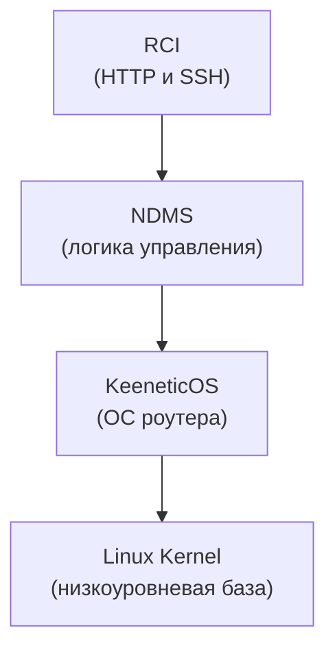

# Keenetic RCI

Kotlin/Java SDK для взаимодействия с Keenetic NDMS RCI через HTTP или SSH.

## Содержание

- [Обзор](#обзор)
- [Статус проекта](#статус-проекта)
- [Подключение](#подключение)
- [Использование](#использование)
  - [HTTP](#http)
  - [SSH](#ssh)
  - [Сохранение конфигурации](#сохранение-конфигурации)
  - [Fail-safe механизм](#fail-safe-механизм)
- [Доступные API](#доступные-api)
  - [Configuration API](#configuration-api)
  - [System API](#system-api)
  - [Interface API](#interface-api)
  - [Routing API](#routing-api)
  - [Raw API](#raw-api)

## Обзор

`keenetic-rci` — библиотека для программного взаимодействия с роутерами Keenetic через NDMS RCI.

Keenetic управляется через NDMS (Network Device Management System). RCI — это слой доступа к внутренней модели NDMS, 
через который работают CLI, Web UI, HTTP API, мобильное приложение и облако.

`keenetic-rci` дает один API поверх двух способов обращения к этой модели:

- `HTTP/RCI`: JSON-запросы в `POST /rci/`;
- `CLI/RCI (over SSH)`: текстовые NDMS-команды вроде `show version` и `show interface`.



## Статус проекта

Проект находится в активной разработке. Сейчас библиотека реализует только часть возможностей Keenetic NDMS RCI.
Остальные функции будут добавляться постепенно.

Актуальный список поддерживаемых API описан в разделе [Доступные API](#доступные-api).

> [!NOTE]
> На данный момент библиотека протестирована на роутере **Keenetic Giga** с версией KeeneticOS **5.0.11**.

## Подключение

Подключить библиотеку можно напрямую из GitHub через [JitPack](https://jitpack.io/#khetaghub/keenetic-rci).

Kotlin DSL

`settings.gradle.kts`:

```kotlin
dependencyResolutionManagement {
    repositories {
        mavenCentral()
        maven("https://jitpack.io")
    }
}
```

`build.gradle.kts`:

```kotlin
dependencies {
    implementation("com.github.khetaghub:keenetic-rci:<version>")
}
```

<details>
<summary>Groovy DSL</summary>

`settings.gradle`:

```groovy
dependencyResolutionManagement {
    repositories {
        mavenCentral()
        maven { url 'https://jitpack.io' }
    }
}
```

`build.gradle`:

```groovy
dependencies {
    implementation 'com.github.khetaghub:keenetic-rci:<version>'
}
```

</details>

<details>
<summary>Maven</summary>

```xml
<repositories>
    <repository>
        <id>jitpack.io</id>
        <url>https://jitpack.io</url>
    </repository>
</repositories>

<dependencies>
    <dependency>
        <groupId>com.github.khetaghub</groupId>
        <artifactId>keenetic-rci</artifactId>
        <version>&lt;version&gt;</version>
    </dependency>
</dependencies>
```

</details>

Вместо `<version>` можно указать нужный _tag_, _release_ или _commit hash_ из репозитория [khetaghub/keenetic-rci](https://github.com/khetaghub/keenetic-rci).

## Использование

### HTTP

> [!IMPORTANT]
> Пользователь Keenetic, указанный в `credentials(...)`, должен иметь как минимум доступ **«Веб-конфигуратор»**.

```kotlin
import com.github.khetaghub.keenetic.rci.api.KeeneticApi
import com.github.khetaghub.keenetic.rci.transport.HttpTransport

val transport = HttpTransport.builder()
    .baseUrl("192.168.1.1") // также можно указать доменное имя KeenDNS
    .credentials("admin", "password")
    .build()

val api = KeeneticApi.create(transport)

val version = api.system().version()
```

<details>
<summary>Java</summary>

```java
import com.github.khetaghub.keenetic.rci.api.KeeneticApi;
import com.github.khetaghub.keenetic.rci.api.KeeneticTransport;
import com.github.khetaghub.keenetic.rci.api.Version;
import com.github.khetaghub.keenetic.rci.transport.HttpTransport;

KeeneticTransport transport = HttpTransport.builder()
    .baseUrl("192.168.1.1") // также можно указать доменное имя KeenDNS
    .credentials("admin", "password")
    .build();

KeeneticApi api = KeeneticApi.create(transport);

Version version = api.system().version();
```

</details>

`HttpTransport` авторизуется лениво при первом запросе и один раз повторяет авторизацию, если получает ответ `401`.

### SSH

> [!IMPORTANT]
> Пользователь Keenetic, указанный в `credentials(...)`, должен иметь как минимум доступ **«Командная строка»**.

```kotlin
import com.github.khetaghub.keenetic.rci.api.KeeneticApi
import com.github.khetaghub.keenetic.rci.transport.SshTransport

val transport = SshTransport.builder()
    .host("192.168.1.1")
    .credentials("admin", "password")
    .allowAnyHostKey()
    .build()

val api = KeeneticApi.create(transport)

val version = api.system().version()
```

<details>
<summary>Java</summary>

```java
import com.github.khetaghub.keenetic.rci.api.KeeneticApi;
import com.github.khetaghub.keenetic.rci.api.KeeneticTransport;
import com.github.khetaghub.keenetic.rci.api.Version;
import com.github.khetaghub.keenetic.rci.transport.SshTransport;

KeeneticTransport transport = SshTransport.builder()
    .host("192.168.1.1")
    .credentials("admin", "password")
    .allowAnyHostKey()
    .build();

KeeneticApi api = KeeneticApi.create(transport);

Version version = api.system().version();
```

</details>

Для production-использования лучше передавать `knownHostsFile(...)` или собственный `hostKeyVerifier(...)` вместо `allowAnyHostKey()`.

### Сохранение конфигурации

NDMS разделяет **running-конфигурацию** и **startup-конфигурацию**. Если изменения должны пережить перезагрузку, нужно вызвать:

```kotlin
api.configuration().save()
```

Обычно это нужно после изменяющих операций, например:

```kotlin
api.routing().addDomainGroup(
    DomainGroup(
        name = "work",
        description = "Рабочие домены",
        addresses = listOf("example.org", "corp.example.com"),
    )
)
api.configuration().save()
```

### Fail-safe механизм

SDK поддерживает fail-safe сценарий Keenetic, когда устройство может автоматически откатить несохраненные изменения и перезагрузиться, если сессия не будет подтверждена:

```kotlin
api.configuration().failSafeTimer(60)

// выполняем изменения...

api.configuration().failSafeCommit()
```

`failSafeTimer(seconds)` настраивает или перенастраивает таймер с действием `reboot`. Это состояние сохраняется между перезагрузками и не требует отдельного `api.configuration().save()`.

Доступные операции:

- `failSafeTimer(seconds)` — настраивает или перенастраивает fail-safe таймер в диапазоне `60..86400` секунд.
- `disableFailSafeTimer()` — отключает fail-safe таймер.
- `failSafeKeepAlive()` — тихо перезапускает активный таймер; если fail-safe режим неактивен или изменений нет, устройство ничего не делает.
- `failSafeCommit()` — фиксирует все несохраненные изменения и останавливает таймер.
- `failSafeRollback()` — откатывает все несохраненные изменения и перезагружает устройство; если изменений нет, устройство ничего не делает.

Отключение таймера тоже доступно через API:

```kotlin
api.configuration().disableFailSafeTimer()
```

Практическое замечание по текущим прошивкам:

- Если fail-safe уже был активен, `failSafeTimer(60)` может вернуть не `Enabled a 60-second fail-safe "reboot" timer.`, а `Bumped up to 60 seconds.`.
- Перед автоматизацией rollback полезно проверять `api.configuration().lastChange().failSafe`. Если `unsaved == false` и `timeLeft == 0`, устройство может проигнорировать `failSafeRollback()` с сообщением `Ignored a fail-safe rollback: no pending changes.`.
- Для части сценариев fail-safe начинает "видеть" изменения только после `system configuration save` / `copy running-config startup-config`. Это наблюдаемое поведение прошивки, а не гарантия SDK.

## Доступные API

Главный фасад SDK — `KeeneticApi`. Он делит доступ к устройству на несколько специализированных областей:

- `executeRaw(...)` — низкоуровневый доступ, если типизированного метода еще нет.
- `configuration()` — состояние и сохранение конфигурации.
- `interfaces()` — список интерфейсов устройства.
- `routing()` — FQDN-группы и DNS routing rules.
- `system()` — системная информация, например версия прошивки.

### Raw API

Если в SDK еще нет типизированного метода, можно использовать `executeRaw(rawCommand)`.

Поведение зависит от выбранного транспорта:

- `HttpTransport`: ожидает готовое JSON-тело запроса для `POST /rci/`.
- `SshTransport`: ожидает CLI-команду NDMS.

Пример для `HttpTransport`:

```kotlin
val response = api.executeRaw(
    """
    [
      {
        "show": {
          "version": {}
        }
      }
    ]
    """.trimIndent()
)
```

<details>
<summary>Java</summary>

```java
String response = api.executeRaw("""
    [
      {
        "show": {
          "version": {}
        }
      }
    ]
    """);
```

</details>

Пример для `SshTransport`:

```kotlin
val response = api.executeRaw("show version")
```

<details>
<summary>Java</summary>

```java
String response = api.executeRaw("show version");
```

</details>

### Configuration API

`configuration()` — фасад для операций над конфигурацией Keenetic.

| Метод | Что делает |
| --- | --- |
| `api.configuration().lastChange()` | Возвращает информацию о последнем изменении конфигурации (`LastChange`) |
| `api.configuration().save()` | Сохраняет running-конфигурацию в startup-конфигурацию |
| `api.configuration().failSafeTimer(seconds)` | Настраивает или перенастраивает fail-safe таймер с действием `reboot` |
| `api.configuration().disableFailSafeTimer()` | Отключает fail-safe таймер |
| `api.configuration().failSafeKeepAlive()` | Тихо перезапускает активный fail-safe таймер |
| `api.configuration().failSafeCommit()` | Фиксирует несохраненные изменения и останавливает таймер |
| `api.configuration().failSafeRollback()` | Откатывает несохраненные изменения и перезагружает устройство |


### Interface API

`interfaces()` — фасад для чтения интерфейсов, известных NDMS.

| Метод | Что делает |
| --- | --- |
| `api.interfaces().getInterfacesList()` | Возвращает список интерфейсов (`List<Interface>`) |

### System API

`system()` — фасад для системной информации устройства.

| Метод | Что делает |
| --- | --- |
| `api.system().version()` | Возвращает версию прошивки и данные платформы (`Version`) |

### Routing API

`routing()` — фасад для управления маршрутами IPv4, IPv6, DNS и DNS-группами.  

| Метод | Что делает |
| --- | --- |
| `api.routing().getDomainGroupsList()` | Возвращает список групп доменов (`List<DomainGroup>`) |
| `api.routing().addDomainGroup(domainGroup)` | Создает или обновляет группу доменов с описанием и адресами |
| `api.routing().deleteDomainGroup(domainGroupName)` | Удаляет группу доменов по имени |
| `api.routing().getDomainGroupRoutingRulesList()` | Возвращает DNS routing rules (`List<DomainGroupRoutingRule>`) |
| `api.routing().addDomainGroupRoutingRule(rule)` | Добавляет DNS routing rule для группы доменов через выбранный интерфейс |
| `api.routing().deleteDomainGroupRoutingRule(domainGroupName, interfaceName)` | Удаляет DNS routing rule по группе доменов и интерфейсу |
