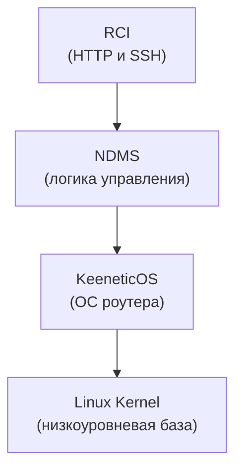

# Keenetic RCI

Kotlin SDK для взаимодействия с Keenetic NDMS RCI через HTTP или SSH.

## Содержание

- [Обзор](#обзор)
- [Использование](#использование)
  - [HTTP](#http)
  - [SSH](#ssh)
  - [Сохранение конфигурации](#сохранение-конфигурации)

## Обзор

`keenetic-rci` — Kotlin-библиотека для программного взаимодействия с роутерами Keenetic через NDMS RCI.

Keenetic управляется через NDMS (Network Device Management System). RCI — это слой доступа к внутренней модели NDMS, 
через который работают CLI, Web UI, HTTP API, мобильное приложение и облако.

`keenetic-rci` дает один Kotlin API поверх двух способов обращения к этой модели:

- `HTTP/RCI`: JSON-запросы в `/rci/`;
- `CLI/RCI (over SSH)`: текстовые NDMS-команды вроде `show version` и `show interface`.



## Использование

### HTTP

```kotlin
import com.github.khetaghub.keenetic.rci.api.KeeneticApi
import com.github.khetaghub.keenetic.rci.transport.HttpTransport

val transport = HttpTransport.builder()
    .baseUrl("192.168.1.1")
    .credentials("admin", "password")
    .build()

val api = KeeneticApi.create(transport)

val version = api.system().version()
```

`HttpTransport` авторизуется лениво при первом запросе и один раз повторяет авторизацию, если получает ответ `401`.

### SSH

```kotlin
import com.github.khetaghub.keenetic.rci.api.KeeneticApi
import com.github.khetaghub.keenetic.rci.transport.SshTransport

val transport = SshTransport.builder()
    .host("192.168.1.1")
    .credentials("admin", "password")
    .allowAnyHostKey()
    .build()

val api = KeeneticApi.create(transport)

val version = api.system().version()
```

Для production-использования лучше передавать `knownHostsFile(...)` или собственный `hostKeyVerifier(...)` вместо `allowAnyHostKey()`.

### Сохранение конфигурации

NDMS разделяет **running-конфигурацию** и **startup-конфигурацию**. Если изменения должны пережить перезагрузку, нужно вызвать:

```kotlin
api.system().configurationSave()
```
